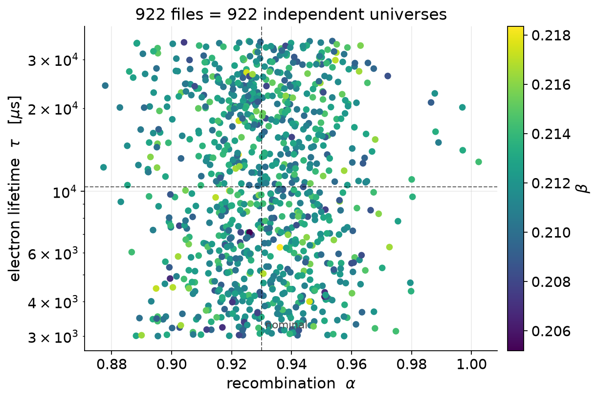
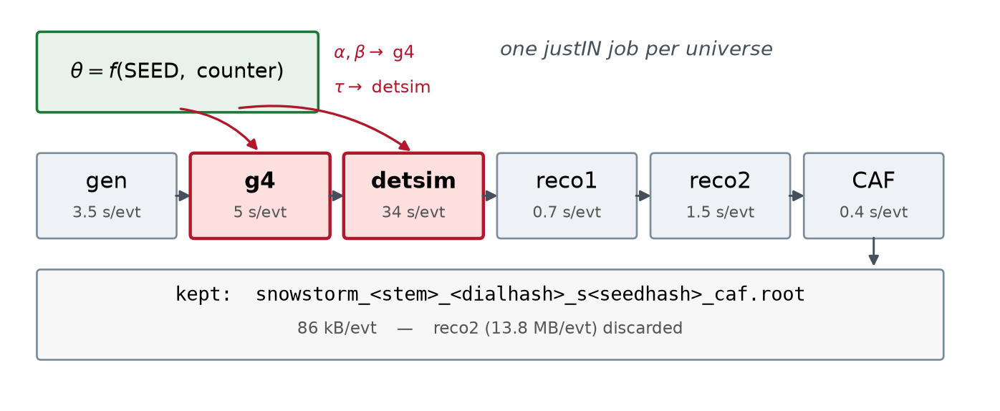
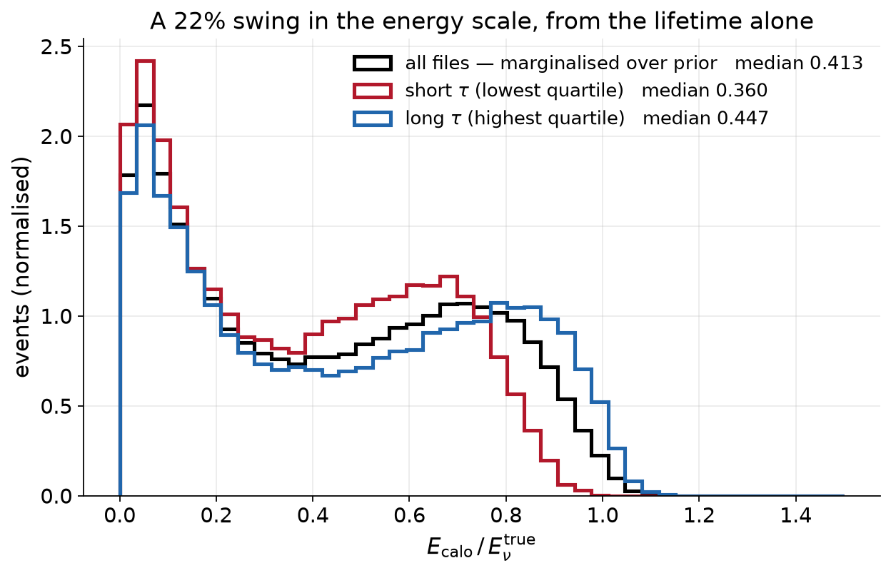
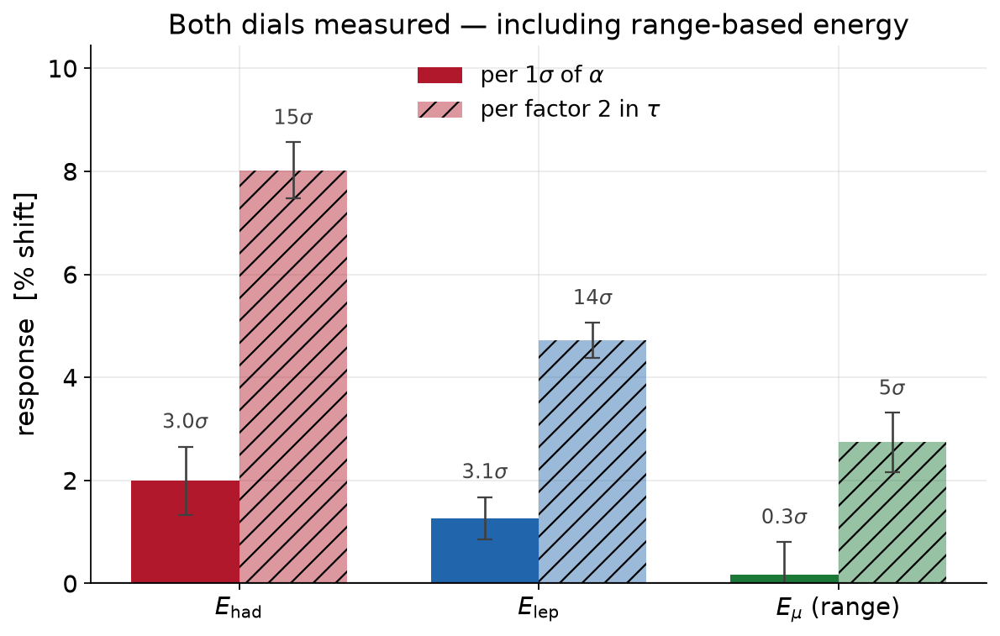
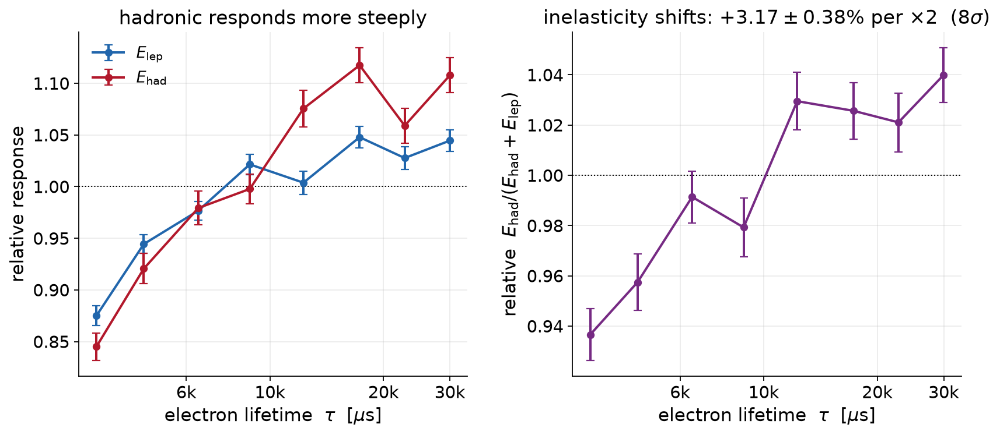
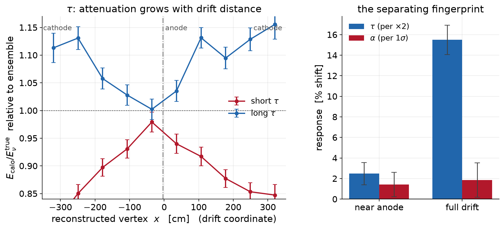
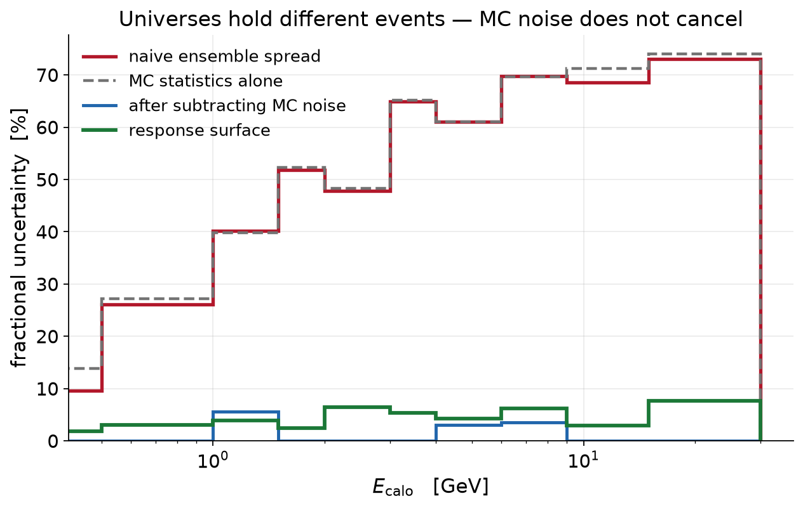

<!-- _paginate: false -->
<!-- _header: '' -->

# Continuous detector systematics for DUNE
## A SnowStorm production and analysis chain on the FD-HD

**<!-- YOUR NAME -->**  ·  <!-- institute -->  ·  <!-- date -->

<br>

100k atmospheric-neutrino events, each simulated at its **own** detector
parameter point — built, run, and analysed end to end.

<span class="small">justIN workflow 20447 · dunesw v10_16_00d00 · seed `atmnu-hd-2026a` · dial set `e1d55d70`</span>

---

# The problem: detector systematics, the expensive way

**Today:** one nominal sample + N dedicated samples, each shifted by ±1σ in one dial.

- a **full simulation pass per shifted sample** — the cost scales with the number of dials
- only the dials someone chose in advance, only at the points they chose
- nothing **between** the points, and nothing **off-axis** in the joint parameter space
- correlations between dials are *asserted*, not measured

<br>

<span class="lead">We want the detector response as a **continuous function** of the parameters — not its value at three points.</span>

<br>

<span class="small">Same problem IceCube solved with SnowStorm; DUNE's DetSuM effort attacks it with repeated
discrete points. What follows is the continuous complement, built on justIN.</span>

---

# The SnowStorm idea: one sample, continuously thrown

Draw the detector parameters **per file** from a prior, then simulate normally.
The ensemble samples the joint distribution

$$p(E_{\rm reco},\ \theta)\;=\;p(E_{\rm reco}\,|\,\theta)\;p(\theta)$$

**The inversion that makes it work:** a per-file summary statistic plotted against
that file's thrown parameter **is** the response curve. No shifted samples, no reweighting.



<span class="small">922 files → 922 independent points in (α, β, τ). Dashed lines mark nominal.</span>

---

# The infrastructure



| | |
|---|---|
| **Reproducible throw** | θ = f(SEED, counter), independent of the workflow ID — re-running a counter reproduces the parameter point |
| **Dials in one file** | `dials.json`: fcl path + stage + prior. Here ModBoxA/B at **g4**, WireCell lifetime at **detsim** |
| **Self-describing output** | parameters recoverable **from the filename alone** (stem + dial hash + seed hash); also written to MetaCat as `snowstorm.*` |
| **One job per universe** | gen→CAF in a single justIN job; only CAFs kept |

---

# Production: what it cost, what it delivered

Cost model **measured, not estimated**: `T(n) ≈ 245 s + 45 s × n` locally, ~80 s/event on the grid
(6× site-to-site spread). detsim alone is **75%** of the marginal cost.

- **1000 jobs × 100 events ≈ 2300 core-hours**, ~1 day wall-clock
- **5.7 GB of CAFs** — keeping reco2 would have cost **~940 GB** (165×)
- 0.3–0.6 % hard job failures; peak RSS 3.0 GB against a 4 GB request
- slow tail = rare multi-hour shower events → 10 h wall budget;
  with `randompolicy` a retry draws **new events at the same θ**, so retries converge

**991 / 1000 files · 991 distinct parameter points · ~99k events**

| dial | fcl parameter | prior thrown | delivered |
|---|---|---|---|
| α | `LArG4Parameters.ModBoxA` | Gaussian 0.93 ± 0.02 | 0.9303 ± 0.0191 |
| β | `LArG4Parameters.ModBoxB` | Gaussian 0.212 ± 0.002 | 0.2120 ± 0.0020 |
| τ | WireCell `structs.lifetime` | log-uniform 3–35 ms | 13.3 ± 9.1 ms, spans 3.0–34.9 ms |

<span class="small">
Datasets (90 d): `usertests:snowstorm-atmnu-hd-1x2x6-caf-fnal-w20447s1p1`, `…-flatcaf-…s1p2`.
**Caveat:** 922 of the 991 are analysed below — 69 sit on replicas unreachable from the gpvm
(CCIN2P3 TLS, NIKHEF token). Their throws are indistinguishable from the analysed set
(−1.1σ, −1.1σ, −0.3σ in α, β, τ): the loss is unbiased, not a coverage hole.
</span>

---

# It works: the systematic is visible in the raw spectrum



Splitting the **same ensemble** by thrown lifetime moves the reconstructed energy scale by **22%**
(median $E_{\rm calo}/E_\nu^{\rm true}$: 0.360 → 0.447). No special analysis — just a cut on a number in the filename.

---

# Both dials measured — and one surprise



| observable | per 1σ of α | per factor 2 in τ |
|---|---|---|
| $E_{\rm had}$ | +1.99 ± 0.66 % (3.0σ) | **+8.02 ± 0.55 % (14.7σ)** |
| $E_{\rm lep}$ | +1.26 ± 0.41 % (3.1σ) | **+4.72 ± 0.35 % (13.6σ)** |
| $E_\mu$ from **range** | +1.29 ± 0.45 % (2.9σ) | **+4.64 ± 0.38 % (12.2σ)** |

**Range-based muon energy is not immune.** Range is geometric, so this is not a charge-scale effect:
attenuated charge at long drift falls below hit threshold and tracks reconstruct **short**.
Not a selection effect — efficiency moves only 0.7% per factor-2 τ (91.1% → 93.0%).

---

# Not just an energy scale: the inelasticity moves



Hadronic energy responds **1.7× more steeply** than leptonic, so the *sharing* shifts:
$f_{\rm had}=E_{\rm had}/(E_{\rm had}+E_{\rm lep})$ moves **+3.17 ± 0.38 % per factor-2 τ (8.3σ)**.

A pure energy-scale error would cancel in this ratio. It does not — which matters directly for
analyses binning in inelasticity, or using it for ν/ν̄ separation.

---

# The fingerprint that separates the dials



Lifetime attenuates as $e^{-t_{\rm drift}/\tau}$, so its effect **grows with drift distance** — a clean V
centred on the anode, symmetric to both cathodes. Recombination is a uniform charge-scale error: **flat**.

| | near anode | full drift |
|---|---|---|
| **τ** (per ×2) | +2.48 ± 1.09 % | **+15.49 ± 1.44 %** |
| **α** (per 1σ) | +1.42 ± 1.19 % | +1.85 ± 1.66 % |

**⇒ the two dials are not degenerate** — a fit can separate them using where the event happened.
Also: the whole-detector number (+8%) **understates** the effect at full drift (~+16%).

---

# Turning the ensemble into an analysis input



**The trap:** in an ordinary multisim, universes are *reweightings of the same events*, so MC noise is
common and cancels in the covariance. Here every file holds **different events** — it does not cancel.

| $E_{\rm calo}$ bin | naive spread | MC stat alone | after subtraction | **response surface** |
|---|---|---|---|---|
| 0.5–1 GeV | 26.1 % | 27.1 % | 0 % | **3.0 %** |
| 2–3 GeV | 47.8 % | 48.4 % | 0 % | **6.5 %** |
| 15–30 GeV | 73.0 % | 74.0 % | 0 % | **7.6 %** |

At ~92 events/universe the naive covariance overstates the systematic **~20×**; subtracting leaves a
difference of two large noisy numbers. Regressing across all 922 universes recovers it cleanly.
Closure test: calibrate on half the sample, recover the throw on the other half — **χ²/dof = 2.4, no bias**.

---

# What we learned, and what to run next

**The method works and the chain is production-ready.** Concrete outcomes:

1. **Throw α wider — this is the main recommendation.** The ±2.2% Gaussian prior needed ~900 universes
   to reach 3σ. A **wide uniform** throw, reweighted afterwards to whatever prior the systematics group
   settles on, makes the sample reusable and the response measurable. One line in `dials.json`.
2. **More files beats more events per file** — same CPU, better coverage of the parameter space.
3. **Counter-derived generator seeds** would unlock *paired sampling* (same events at two θ, MC noise
   cancelling in the derivative). `randompolicy` currently forecloses this; it costs nothing to change.
4. **Next dials:** DL/DT, electronics gain; and the same chain on VD.
5. **Priors need signing off** by the systematics group — the current ones are reverse-engineered
   from DetSuM grid spacing.

<span class="small">Code, dial sets, jobscripts and these figures: `snowstorm-justin` repo · `docs/ATMNU_HD_PRODUCTION.md`</span>

---

<!-- _header: 'Backup' -->
# Backup: measured per-stage cost

dunesw v10_16_00d00, geometry v6, one core, HD 1x2x6 atmospheric events:

| stage | fcl | s/event | output/event |
|---|---|---|---|
| gen | `prodgenie_atmnu_max_weighted_randompolicy_dune10kt_1x2x6.fcl` | 3.6 | 12 kB |
| g4 | `standard_g4_dune10kt_1x2x6.fcl` | 5.0 | 6.2 MB |
| **detsim** | `standard_detsim_dune10kt_1x2x6.fcl` | **34** | 11.6 MB |
| reco1 | `standard_reco1_dune10kt_1x2x6.fcl` | 0.7 | 11.8 MB |
| reco2 | `standard_reco2_atmos_dune10kt_1x2x6.fcl` | 1.5 | 13.8 MB |
| CAF | `standard_cafmaker` + `IsAtmoCVN` | 0.4 | **86 kB** |

Grid reality differs from the bench: the canary saw 1313 / 1819 / 2435 s for 20 events at three UK
sites, while a production job did 100 events in 2064 s on an AMD EPYC at Sheffield — an **18 → 110
s/event spread across sites**, which is what the wall-time headroom is really for.

---

<!-- _header: 'Backup' -->
# Backup: three fcl traps found by running them

| trap | symptom | fix |
|---|---|---|
| `_geov5` reco2/cafmaker fcls | job aborts: *"Geometry used for run … is incompatible"* | drop the suffix — the standard chain is **v6** in v10_16_00d00 |
| `standard_cafmaker_dune10kt_1x2x6.fcl` | **segfaults** on event 1 of atmospheric reco2 | `physics.analyzers.cafmaker.IsAtmoCVN: true` |
| CAF `runreco-…` variant | redundant | reco2 already runs `ereco`/`anglereco`/CVN — CAF is pure packaging at 0.4 s/evt |

**Operational notes**

- reading these CAFs over the `/pnfs` NFS mount hung a reader in **uninterruptible sleep for 35 h**
  (`timeout` cannot kill D-state) — read through the dCache **xrootd** door instead
- the default DUNE token carries only `storage.read:/resilient/jobsub_stage`; remote replicas need
  `htgettoken --scopes="storage.read:/ …"`
- `justin show-replicas --mql "…"` gives replica URLs without an X509 proxy

---

<!-- _header: 'Backup' -->
# Backup: reproducibility and bookkeeping

Every output file names its own parameter point:

```
snowstorm_dune10kt_1x2x6_000252_e1d55d70_s2ea20f_caf.root
                        │         │        └─ seed hash
                        │         └─ dial-set hash (priors + fcl paths)
                        └─ stem = sample + counter
```

```bash
python3 bin/snowstorm_lookup.py --from-name <file> \
        --seed atmnu-hd-2026a --dials dials/recomb_lifetime_v1.json
```

- the same values are attached in MetaCat as `snowstorm.alpha/beta/etau/key/seed/dial_hash`
- **verified:** every canary file and a random sample of production files match the values
  predicted *before submission*, to the last digit
- a **changed prior changes the dial hash**, so samples with different priors can never be confused
- `OFFSET` separates canary from production counters — identical counters would otherwise collide
  in both filename and subrun number
